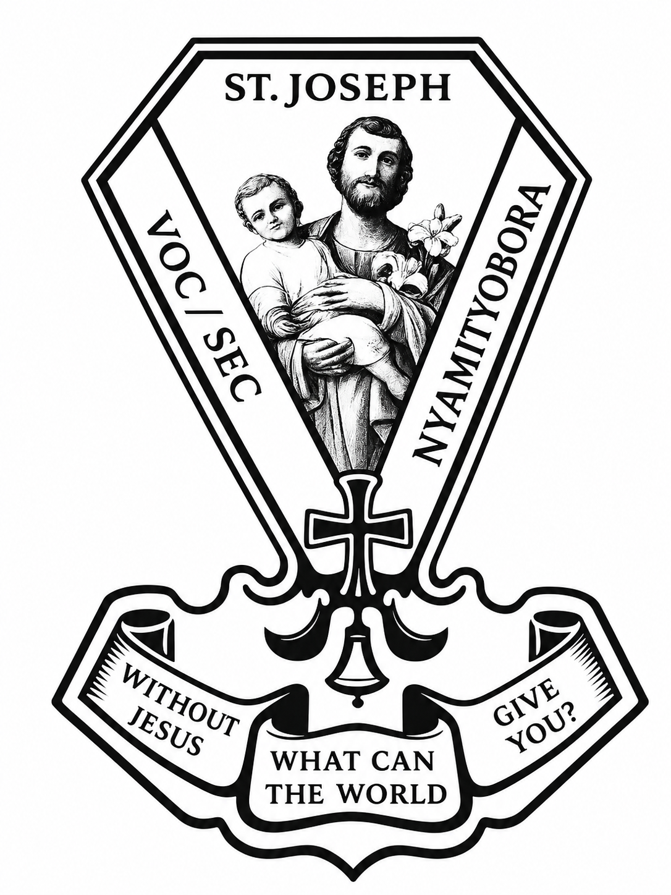

# 🎤 St. Joseph Secondary School Nyamityobora Debate Club Website



## 🌟 Welcome

Welcome to the official website of the **St. Joseph Secondary School Nyamityobora Debate Club**.

This website was created to promote debate, public speaking, poetry, leadership, research, and academic excellence among students.

---

## 🏫 School Information

**School:** St. Joseph Secondary School Nyamityobora

**Address:** P.O. Box 406, Mbarara, Uganda

**Motto:**

> "Without Jesus, What can the world give you?"

---

# 🎯 Website Features

- 🏠 Professional Home Page
- 📖 About the Debate Club
- 👥 Club Cabinet
- 📅 Events & Competitions
- 🖼 Gallery
- 📰 News & Announcements
- 📚 Learning Resources
- 🤖 AI Research Assistant
- 📞 Contact Page
- 🔐 Admin Dashboard
- 🚫 Custom 404 Error Page
- 📱 Mobile Responsive Design
- 🌙 Dark Mode
- ⏳ Countdown Timer
- 💬 WhatsApp Contact Button
- 🖼 Image Lightbox
- 🎞 Smooth Animations
- 🔍 Search-ready Structure

---

# 📁 Project Structure

```
Debate-Club-Website/

│

├── index.html

├── about.html

├── cabinet.html

├── events.html

├── gallery.html

├── news.html

├── resources.html

├── ai.html

├── contact.html

├── admin.html

├── 404.html

│

├── css/

│     ├── style.css

│     └── responsive.css

│

├── js/

│     └── script.js

│

├── assets/

│     ├── images/

│     └── icons/

│

└── README.md
```

---

# 🖼 Images Required

Place all website images inside

```
assets/images/
```

Examples:

- logo.png
- hero.jpg
- debating.jpg
- poetry.jpg
- public-speaking.jpg
- reading.jpg
- debate-poster.jpg
- gallery1.jpg
- gallery2.jpg
- gallery3.jpg
- photo-month.jpg

---

# 📅 Club Meetings

Every Saturday

2:00 PM – 5:00 PM

School Hall

---

# 🏆 Upcoming Competition

Inter-School Debate Competition

📅 4 July 2026

Venue:

St. Joseph Secondary School Nyamityobora

---

# 📞 Contact

**Address**

P.O. Box 406

Mbarara, Uganda

**Email**

st.josephthejust@gmail.com

**Telephone**

0704050747

**WhatsApp**

0764578583

---

# 🚀 Publishing on GitHub

1. Create a GitHub repository.

2. Upload all project files.

3. Go to

Settings → Pages

4. Choose

Deploy from Branch

5. Select

main

6. Save.

Your website will be live at

```
https://YOUR_USERNAME.github.io/REPOSITORY-NAME/
```

---

# 🔮 Future Improvements

- Firebase Login
- Online Database
- Live AI Assistant
- Online Gallery Uploads
- Admin Content Management
- Debate Registration System
- Student Accounts
- Competition Registration
- Email Notifications
- Certificates Generator
- Online Voting
- Live Chat

---

# 👨‍💻 Developer

Website developed for

**St. Joseph Secondary School Nyamityobora Debate Club**

Project Coordinator:

**Owomugisha Rodgers S.5S**

Academic Year

**2026-2027**

---

# 📜 License

This project is created for educational purposes and the official activities of the St. Joseph Secondary School Nyamityobora Debate Club.

© 2026 St. Joseph Secondary School Nyamityobora Debate Club.

All Rights Reserved.